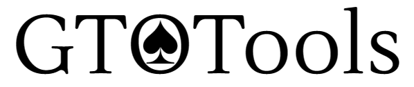
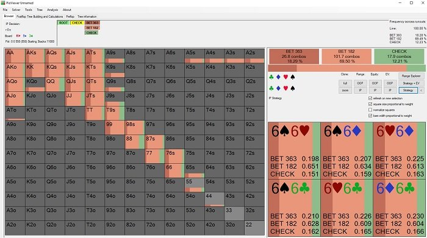
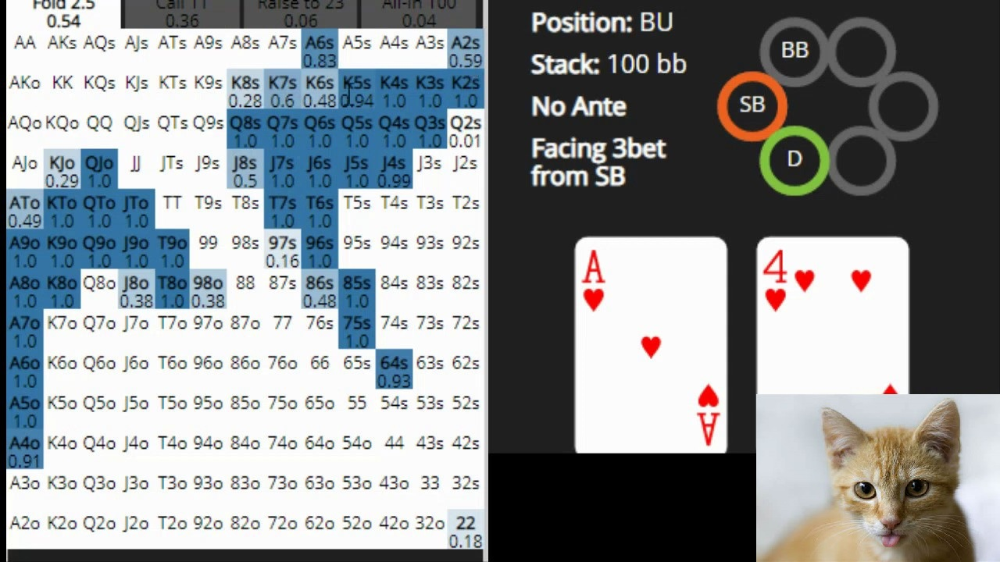

  

Este proyecto tiene como objetivo la creación de una aplicación web que calcule las probabilidades de ganar una mano de poker, facilitando al jugador la toma de decisiones en sus partidas.

La aplicación constará de una interfaz gráfica donde se mostrará un mapa de manos posibles, mostrando mediante un código de colores la probabilidad de ganar con tu mano actual y la apuesta realizada.

Las siguientes imágenes ejemplifican la idea principal:

  

  

A continuación un prototipo de la aplicación

