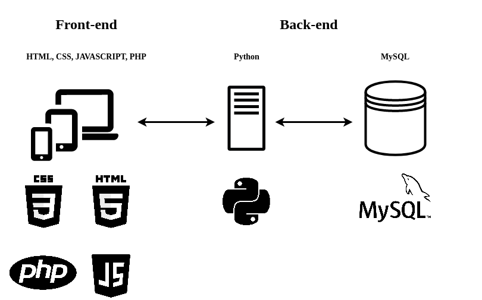

<a href="README.md">Español</a> / <a href="README_en.md">Inglés</a>

## Descripción del problema:

En el poker se toman multitud de decisiones que involucran cálculos matemáticos complejos. Incluso para los jugadores avanzados retener toda esta información puede ser engorroso. Por si esto fuera poco, existe un tiempo límite para la toma de decisiones, por lo que en muchas ocasiones es necesario sacrificar precisión por velocidad.

## Solución propuesta:

Este proyecto tiene como objetivo la creación de una aplicación web para ayudar al jugador en su toma de decisiones. 

La aplicación constará de una interfaz gráfica donde se mostrará un mapa de manos posibles, mostrando mediante un código de colores la probabilidad de ganar con tu mano actual y la apuesta realizada.

El jugador podrá definir las condiciones del juego (mano, apuesta, rivales, etc.) y la aplicación le orientará hacia la mejor jugada según la teoría de juego óptima (GTO).

Las siguientes imágenes ejemplifican la idea principal:

 

  

 

A continuación un prototipo de la aplicación:

 

