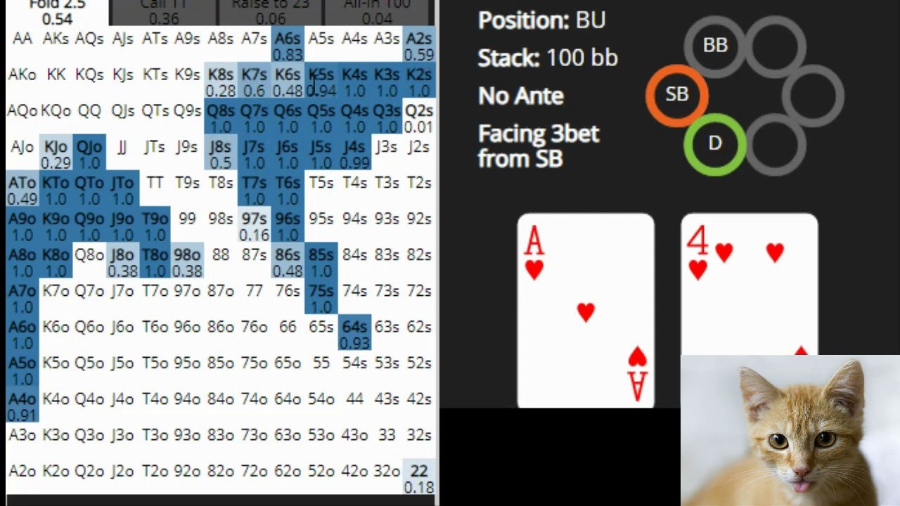

<a href="README.md">Español</a> / <a href="README_en.md">English</a>

## Problem description:

In poker, people make decisions involving complex mathematical calculations. Even for the professional players retaining all that information can be a challenge. On top of that, they are given a small amount of time per decision, so it is often necessary to sacrifice accuracy for speed.

## Proposed Solution:

This project aims to create a web application that will help people make their decisions taking into account the mathematical component of the game.  

The application will consist of a graphical interface where a map of possible hands will be displayed, showing by means of a color code the probability of winning with the current hand and the bet placed.

The player may define the conditions of the game (hand, bet, opponents, etc.) and the application will guide the player to the best play according to the optimal game theory (OGT).

The followings imagenes ilustrate the main idea: 

 

  

 

A prototype of the application is shown below: 

 

