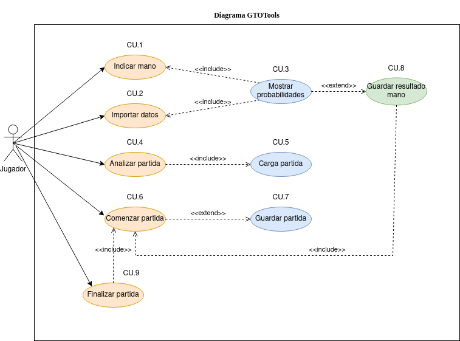

# Diagrama Casos de Uso

El siguiente diagrama se corresponde con el diagrama de casos de uso de este proyecto.

## Especificación de actores

  | Actor | Jugador |
  |---|---|
  | Descripción  | El jugador interactúa con el sistema, solicitando información y decidiendo cómo guardar los resultados, si así lo desea. |
  | Características  | El jugador es una abstracción de cualquier usuario que esté utilizando el programa. No se distinguen jugadores. |
  | Relaciones | |
  | Referencias | |   
  | Notas | |
  | Autor | _Javier García Hernández_ |
  | Fecha | _27/03/2023_ |

## Especificación de casos de uso

|  Caso de Uso	CU.1 | Indicar mano |
|---|---|
| Fuentes  | El caso de uso se sustenta en el siguiente documento: https://github.com/jdabrante/proyecto_ets/blob/develop/doc/anteproyecto/anteproyecto.md |
| Actor  | Jugador |
| Descripción | El jugador indica que mano tiene en ese momento |
| Flujo básico | |
| Pre-condiciones | |  
| Post-condiciones  | |  
|  Requerimientos | |
|  Notas | |
| Autor  | _Javier García Hernández_ |
|Fecha | _27/03/23_ |

|  Caso de Uso	CU.2 | Importar datos |
|---|---|
| Fuentes  | El caso de uso se sustenta en el siguiente documento: https://github.com/jdabrante/proyecto_ets/blob/develop/doc/anteproyecto/anteproyecto.md |
| Actor  | Jugador |
| Descripción | El jugador selecciona el fichero en base al cual se calcularán las probabilidades de éxtio de la jugada |
| Flujo básico | |
| Pre-condiciones | |  
| Post-condiciones  | |  
|  Requerimientos | |
|  Notas | |
| Autor  | _Javier García Hernández_ |
|Fecha | _27/03/23_ |

|  Caso de Uso	CU.3 | Mostrar probabilidades |
|---|---|
| Fuentes  | El caso de uso se sustenta en el siguiente documento: https://github.com/jdabrante/proyecto_ets/blob/develop/doc/anteproyecto/anteproyecto.md |
| Actor  | Sistema |
| Descripción | Según la mano indicada por el jugador, se busca, en el fichero indicado por el jugador, la probabilidad de ganar con dicha mano |
| Flujo básico | |
| Pre-condiciones | Tienen que estar indicadas mano (CU1) e importados los datos (CU2) de los cálculos |  
| Post-condiciones  | |  
|  Requerimientos | |
|  Notas | |
| Autor  | _Javier García Hernández_ |
|Fecha | _27/03/23_ |

|  Caso de Uso	CU.4 |  |
|---|---|
| Fuentes  | El caso de uso se sustenta en [este documento] https://github.com/jpexposito/ets/tree/main/diagramas-comportamiento/diagramas-cu/tareas/tarea7  |
| Actor  | Profesor |
| Descripción | El profesor puede borrar alumnos |
| Flujo básico | El profesor solicita borrar un alumno, si no está autenticado se le solicita (CU1) |  
| Pre-condiciones | Estar autenticado | 
| Post-condiciones  | |  
| Requerimientos | |
| Autor  | _Javier García Hernández_ |
| Fecha | _3/02/23_ |

|  Caso de Uso	CU.5 | Consultar datos alumno |
|---|---|
| Fuentes  | El caso de uso se sustenta en [este documento] https://github.com/jpexposito/ets/tree/main/diagramas-comportamiento/diagramas-cu/tareas/tarea7  |
| Actor  | Profesor |
| Descripción | El profesor puede consultar una serie de datos sobre los alumnos que le corresponden |
| Flujo básico | El profesor solicita consultar información de un alumno, si no está autenticado se le solicita (CU1) |
| Pre-condiciones | Estar autenticado |  
| Post-condiciones  | |  
| Requerimientos | |
| Notas | |
| Autor  | _Javier García Hernández_ |
| Fecha | _3/02/23_ |

|  Caso de Uso	CU.6 | Obtener estadísticas |
|---|---|
| Fuentes  | El caso de uso se sustenta en [este documento] https://github.com/jpexposito/ets/tree/main/diagramas-comportamiento/diagramas-cu/tareas/tarea7  |
| Actor  | Profesor |
| Descripción | El profesor puede solicitar diferentes informes estadísticos |
| Flujo básico | El profesor solicita el informe, si no está autenticado se le solicita (CU1) | 
| Pre-condiciones | Estar autenticado | 
| Post-condiciones  |  |  
| Requerimientos | |
| Notas | |
| Autor  | _Javier García Hernández_ |
| Fecha | _3/02/23_ |

|  Caso de Uso	CU.7 | Visualizar gráfico |
|---|---|
| Fuentes  | El caso de uso se sustenta en [este documento] https://github.com/jpexposito/ets/tree/main/diagramas-comportamiento/diagramas-cu/tareas/tarea7  |
| Actor  | Profesor |
| Descripción |El profesor puede solicitar visualizar informácion representada gráficamente |
| Flujo básico | El profesor solicita ver el gráfico, si no está autenticado se le solicita (CU1) |
| Pre-condiciones | Estar autenticado |  
| Post-condiciones  | |  
| Requerimientos | |
| Notas | |
| Autor  | _Javier García Hernández_ |
| Fecha | _3/02/23_ |

|  Caso de Uso	CU.8 | Calculadora |
|---|---|
| Fuentes  | El caso de uso se sustenta en [este documento] https://github.com/jpexposito/ets/tree/main/diagramas-comportamiento/diagramas-cu/tareas/tarea7  |
| Actor  | Sistema |
| Descripción | La calculadora permite realizar diferentes operaciones matemáticas |
| Flujo básico | Cuando el profesor va a introducir una nota se lanza automáticamente la calculadora |
| Pre-condiciones | Estar completando el acta (CU2) |  
| Post-condiciones  | |  
| Requerimientos | |
| Notas | |
| Autor  | _Javier García Hernández_ |
| Fecha | _3/02/23_ |

