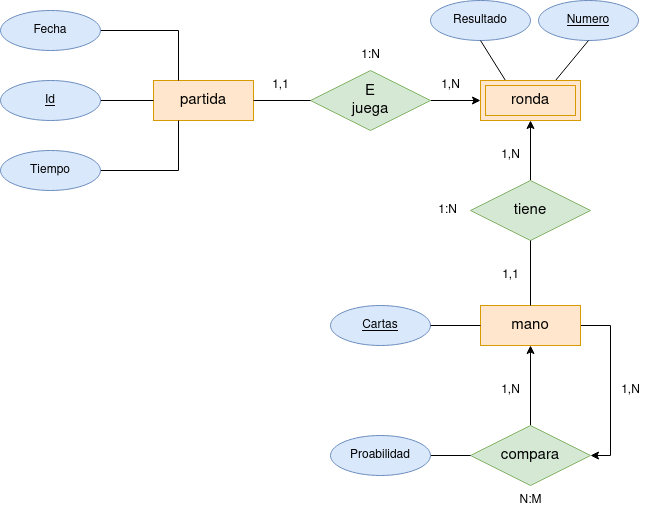

<a href="README.md">Español</a> / <a href="README_en.md">Inglés</a>

# Diagrama entidad-relación 

En el siguiente diagrama se muestras las relaciones existentes así como los atributos pertenecientes a cada tabla de la base de datos.

 

 

La primera entidad que encontramos en el diagrama es "Partida". Esta será una tabla de registros de cada partida guardada, por lo que tendrá como atributos la fecha de cuando se realizó de la partida, un identificador único (numérico autoincremental), el tiempo o duración de la misma y el resultado obtenido al finalizarla (?). Así pues, esta entidad se relación con la tabla "mano" la cual tendrá almacenada todas las manos posibles dentro de una partida de poker, siendo pues está relación N:M ya que una partida se compone de muchas manos y a su vez una mano puede encontrarse en una o más partidas.

Siguiendo con la lectura del diagrama, y como se ha mencionado en el párrafo anterior, la siguiente entidad es "mano" la cual tendrá una relación recursiva con una cardinalidad N:M donde una mano podrá ser comparada con todas las manos posibles, guardonse pues la probabilidad de ganar como un atributo en la entidad de la relación. 

